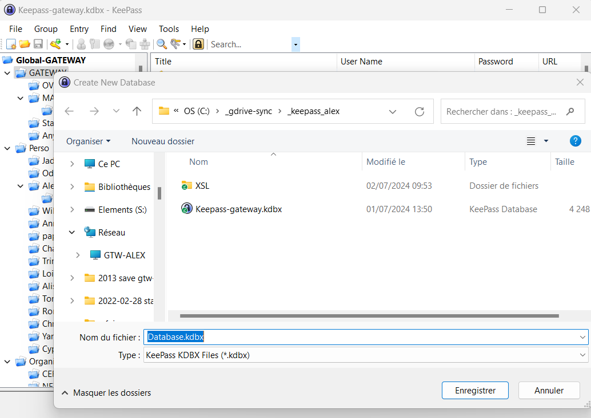
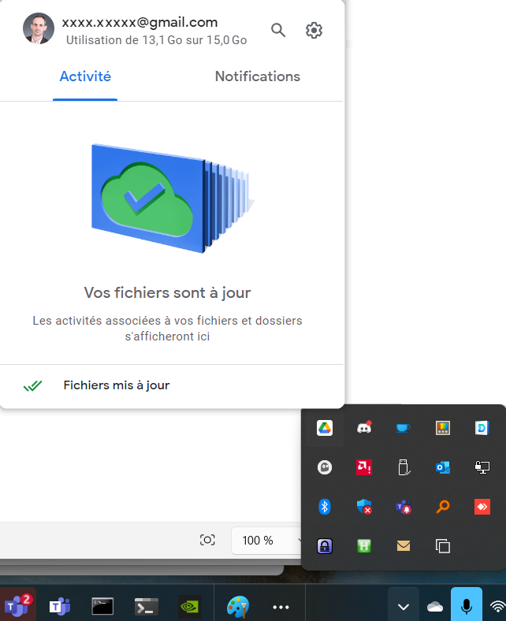
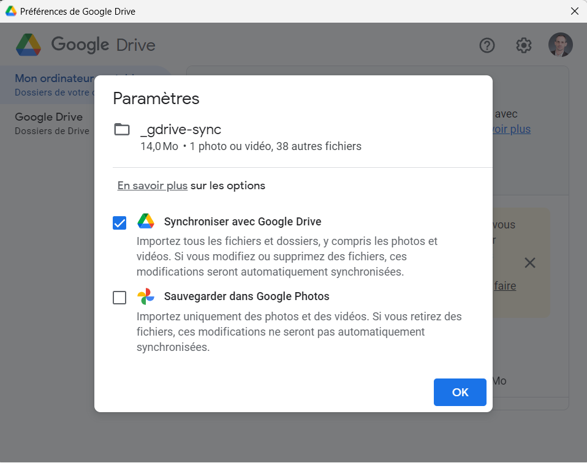
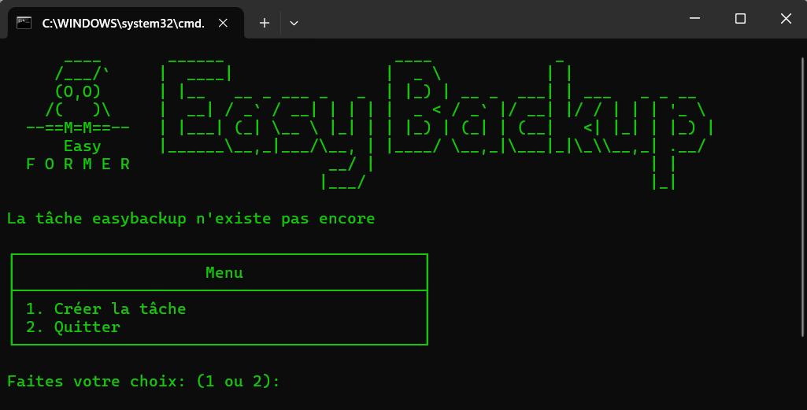
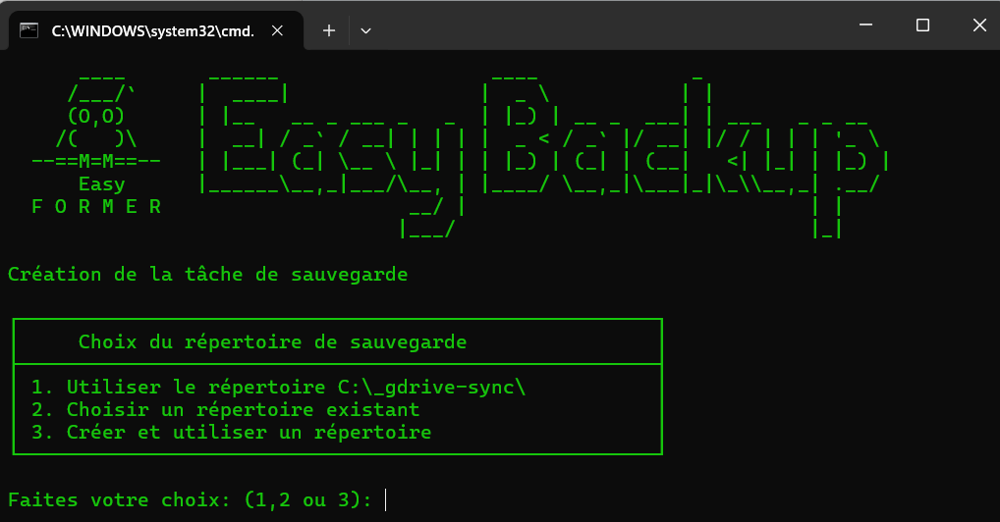
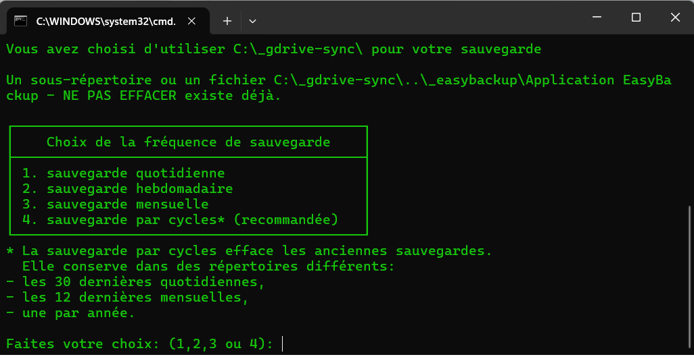
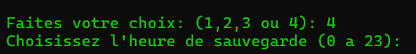
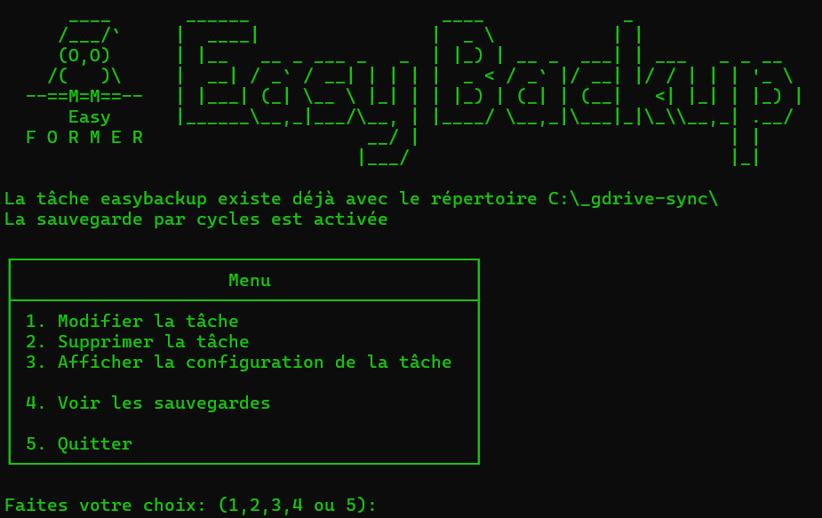

# Easybackup

Easybackup permet de mettre en place une sauvegarde par cycle simplement pour Keepass

Cette procedure permet d'installer le gestionnaire de mot de passe de façon sécuritaire.

# Installation du logiciel de stockage de mot de passe Keepass

> Keepass est préconisé par l'ANSSI:
>
> https://code.gouv.fr/sill/detail?name=KeePass

	
## 1) Téléchargez et installez Keepass ici:

https://sourceforge.net/projects/keepass/files/latest/download

	
## 2) Configurez de la nouvelle base de donnée de Keepass en local dans le répertoire "C:\_gdrive-sync\".

Créez le répertoire "C:\_gdrive-sync\".

Cliquez dans File > New 

Choississez le répertoire "C:\_gdrive-sync\" et nommez votre base avec pertinance:

> A ce niveau vous avez toujours la possibilité de perdre votre matériel ou vos données.
>
> Nous allons dans un second temps les synchroniser sur le Cloud.

# Installation du logiciel Google Drive sur le PC.

## 1) Téléchargez et installez Google Drive ici:

https://www.google.com/drive/download/

## 2) Configuration du logiciel Google Drive afin de syncroniser le répertoire de la base de donnée Keepass.

Cliquez sur l'icone de Google Drive dans la barre des tâches.

Cliquez sur la roue crantée > Préférences > Ajouter un dossier.

Choisissez le dossier "C:\_gdrive-sync\".

Activez la synchronisation.

> A ce niveau vous aurez déja une sauvegarde sur le cloud de Google de vos mots de passes.
>
> Celle-ci vous protègera votre base de mots de passe en cas de hack:
>
> - de votre compte microsoft,
>
> - de votre compte Google.

# Installation de Keepass sur le téléphone

Il faut maintenant pouvoir accéder à vos mots de passe depuis votre téléphone aussi.

 
## 1) Téléchargez et installez Keepass sur votre mobile:

Installez:

 - Soit Keepass Android pour Android,
 
 - Soit KeePassXC pour Iphone.

Par la suite nous choisirons d'ouvrir la base de donnée Keepass (avec l'extention .kdbx) qui se trouve sur votre drive de Google.

Afin de mieux sécuriser l'usage de votre téléphone il conviendra d'activer l'utilisation de votre empreinte de doigt pour déverouiller l'appplication.

> Maintenant vous ne pouvez plus perdre de mot de passe par malveillance.
>
> Vous n'êtes cependant pas à l'abri d'effectuer aussi une mauvaise manupilation.
>
> Nous allons ajouter une sauvegarde locale comprenant des cycles afin de ne pas gaspiller d'espace de stockage.

# Installation du script de sauvegarde EasyBackup

> La sauvegarde par cycles efface les anciennes sauvegardes.
>
> Elle conserve dans des répertoires différents:
>
> - les 30 dernières quotidiennes,
>
> - les 12 dernières mensuelles,
>
> - une par année.

 
## 1) Téléchargez et installez EasyBackup:

Allez sur la page de github:

https://github.com/easyformer/easybackup/blob/main/easybackup.bat

Téléchargez le script easybackup.bat

Executez le suivez simplement les étapes:

>
> Vos sauvegardes par cycles seront disponibles dans "C:\_easybackup"
>
> Maintenant vous avez un système de gestion des mots de passe sécuritaire à tous les niveaux.
>

